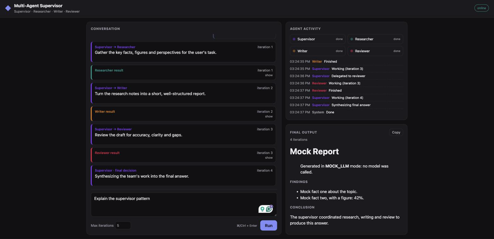
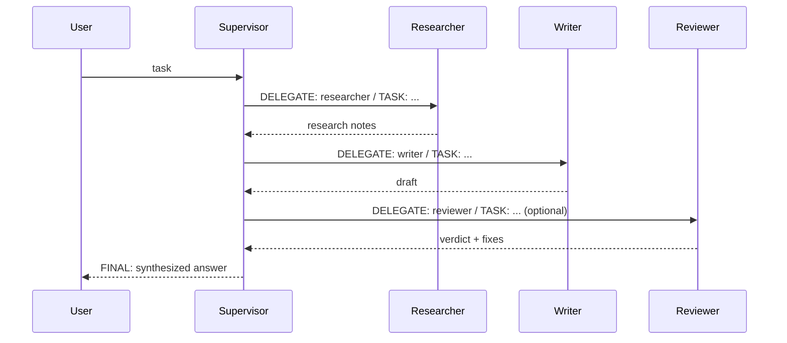

# Multi-Agent Supervisor

A mini research assistant built on the **supervisor pattern**. A Supervisor agent breaks a research task into steps, delegates them to specialized workers (Researcher, Writer, Reviewer), and synthesizes their results into one polished answer. You can watch it happen live in the browser.

**Live demo:** _add your Render URL here after deploying (see [Deploy](#deploy-to-render))_



## Features

- **Supervisor + 3 workers** powered by Claude (`claude-opus-5` by default)
- **DELEGATE/TASK → FINAL** protocol with an iteration limit and forced completion
- **Live web UI**: chat composer, real-time agent activity feed, conversation of supervisor decisions and worker results, rendered Markdown final output; responsive, with dark mode
- **Two APIs**: `POST /run` (JSON) and `POST /run/stream` (Server-Sent Events), plus `GET /health`
- **Offline mock mode** (`MOCK_LLM=1`) for demos and UI work without an API key

## How it works



Each supervisor decision counts as one iteration. If the limit (`max_iterations`, default 5) is reached without `FINAL`, the supervisor is forced to synthesize an answer from the work so far. Details are in [docs/architecture.md](docs/architecture.md).

## Quick start

Requires Python 3.12+ and an [Anthropic API key](https://console.anthropic.com/).

```bash
python3 -m venv .venv
source .venv/bin/activate
pip install -r requirements-dev.txt
export ANTHROPIC_API_KEY=sk-ant-...   # your key
uvicorn main:app --reload
```

Open http://localhost:8000 and submit a task.

### No API key? Use mock mode

```bash
MOCK_LLM=1 uvicorn main:app --reload
```

Mock mode runs the full supervisor loop and UI with canned agent replies; no model is called. Without a key and without mock mode, runs fail with a clear authentication error (HTTP 502 from `/run`, or an `error` event in the stream).

## API

### `POST /run`

```bash
curl -s -X POST localhost:8000/run \
  -H 'Content-Type: application/json' \
  -d '{"task": "Explain the supervisor pattern in multi-agent systems", "max_iterations": 5}'
```

| Field | Type | Rules |
|---|---|---|
| `task` | string | required, 1–4000 characters (trimmed) |
| `max_iterations` | int | optional, 1–10, default 5 |

Response:

```json
{
  "task": "...",
  "final_output": "# Markdown answer ...",
  "iterations": 4,
  "forced": false,
  "steps": [{"type": "start", "...": "..."}, "..."]
}
```

`422` for invalid input; `502` if the Claude call fails (the message is in `detail`).

### `POST /run/stream`

Same request body. The response is `text/event-stream`, with one `data: {json}` line per event (`start`, `agent_start`, `supervisor`, `worker_result`, and finally `final` or `error`). See [docs/architecture.md](docs/architecture.md#event-contract).

```bash
curl -N -X POST localhost:8000/run/stream \
  -H 'Content-Type: application/json' \
  -d '{"task": "Summarize the history of the transistor", "max_iterations": 4}'
```

### `GET /health`

```bash
curl -s localhost:8000/health   # {"status":"ok"}
```

## Configuration

| Env var | Default | Purpose |
|---|---|---|
| `ANTHROPIC_API_KEY` | none | Claude API key (required unless `MOCK_LLM=1`) |
| `ANTHROPIC_MODEL` | `claude-opus-5` | Model for all agents (must support adaptive thinking) |
| `ANTHROPIC_EFFORT` | `medium` | `low` / `medium` / `high` / `xhigh` / `max` |
| `MOCK_LLM` | unset | `1` = offline canned replies |
| `MOCK_LLM_DELAY` | `0.8` | Seconds per mock agent call |

## Testing

```bash
pytest                            # unit + API tests (fake LLM); live test runs only if ANTHROPIC_API_KEY is set
node --test tests/js/*.test.mjs   # SSE parser (Node 20+)
```

`tests/test_live.py` runs a real end-to-end workflow against Claude when `ANTHROPIC_API_KEY` is set.

## Project structure

```
main.py              FastAPI app: /, /health, /run, /run/stream
app/llm.py           the only module that calls Claude
app/agents.py        system prompts + DELEGATE/TASK/FINAL parser
app/orchestrator.py  supervisor loop, yields events
app/mock_llm.py      offline stand-in (MOCK_LLM=1)
static/              web UI (no build step)
tests/               pytest suite + tests/js (node --test)
render.yaml          Render deployment blueprint
```

## Deploy to Render

1. Push this repo to GitHub (already done if you're reading it there).
2. In Render: **New → Blueprint**, then select this repo. Render reads `render.yaml`.
3. When prompted, set `ANTHROPIC_API_KEY`.
4. Once it's live, open the service URL and paste it into the **Live demo** line above.

> **Cost warning:** the deployed app has no authentication or rate limiting, so anyone with
> the URL can start runs (up to 10 iterations on Opus) billed to your API key. Set a monthly
> spend limit in the [Anthropic Console](https://console.anthropic.com/), and for a public
> demo consider keeping the URL private or deploying with `MOCK_LLM=1`.

## Extension ideas

Parallel workers, human-in-the-loop approval, persistent memory across tasks, more workers (Editor, Fact-Checker), and web search for the Researcher via Claude's server-side web search tool.

## License

See [LICENSE](LICENSE).
