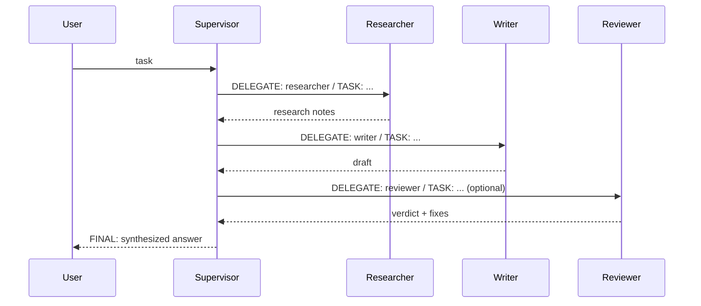

# Documentation, Deployment & Release Implementation Plan (Plan 3 of 3)

> **For agentic workers:** REQUIRED SUB-SKILL: Use superpowers:subagent-driven-development (recommended) or superpowers:executing-plans to implement this plan task-by-task. Steps use checkbox (`- [ ]`) syntax for tracking.

**Goal:** Ship the finished system: a repo README, an architecture/API doc, a Render deployment blueprint, verification from a fresh clone, and a push of `main` to `origin`.

**Architecture:** There is no new application code. `render.yaml` describes a single Render web service that runs the same `uvicorn main:app` command. The docs describe what Plans 1–2 built, and every command in them is executed once to prove it works as written.

**Tech Stack:** Markdown (GitHub-flavored, with Mermaid), Render Blueprint YAML, git.

**Spec:** `requirements.md` (repo root). Builds on `docs/superpowers/plans/2026-09-28-01-backend-orchestration.md` and `docs/superpowers/plans/2026-09-28-02-web-frontend.md`.

## Global Constraints

- Spec deliverables covered here: a tested end-to-end workflow, and the application deployed to Vercel, Railway or Render with its URL provided. The deploy target is **Render**. No Render/Railway/Vercel CLI or account is available to the agent, so the agent delivers the blueprint and exact steps, and the user performs the one-click deploy. The README gets a `Live demo` line that the user fills in with the URL.
- Every shell command written in `README.md` must be executed at least once during this plan and must work exactly as written.
- Docs must match the code: endpoint paths, request fields and limits (`task` 1–4000 chars, `max_iterations` 1–10, default 5), event types, env vars (`ANTHROPIC_API_KEY`, `ANTHROPIC_MODEL` default `claude-opus-5`, `ANTHROPIC_EFFORT` default `medium`, `MOCK_LLM`, `MOCK_LLM_DELAY` default `0.8`).
- Never write a real API key into any file.
- Push only at the very end, after all verification passes: `git push origin main`. Never force-push.
- The Plan 1 constraints still apply: work on `main`, and every commit ends with `Co-Authored-By: Claude Opus 5.5 <noreply@anthropic.com>`.

## Review Focus

1. **A new developer copies the README quickstart onto a clean machine.** It should work with no undocumented steps. Verified in Task 2 by a fresh clone into a scratch directory.
2. **Running without an API key.** The README should say clearly that `/run` returns 502 with the SDK's authentication message, and should point to `MOCK_LLM=1`. Verified in Task 2, Step 3.
3. **Render supplies `$PORT` and runs behind a proxy.** The start command should bind `0.0.0.0:$PORT`, and streaming must not be buffered (`X-Accel-Buffering: no` is already sent). Checked by review of `render.yaml` in Task 1.
4. **Docs drift from the code** (wrong event field names, a wrong default model). The reviewer diffs `docs/architecture.md` against `app/orchestrator.py` and `main.py`. Checked in Task 1, Step 4.
5. **Push rejected** (remote has commits the local repo doesn't have, or an auth failure). Stop and report to the user. Never force-push. Covered in Task 2, Step 5.

---

### Task 1: README, architecture doc, Render blueprint

**Files:**
- Create: `README.md`, `docs/architecture.md`, `render.yaml`

**Interfaces:**
- Consumes: the Plans 1–2 code as the source of truth, and `docs/screenshot.png` from Plan 2, Task 3.
- Produces: the docs and deploy config that Task 2 verifies.

- [ ] **Step 1: Write `render.yaml`**

```yaml
services:
  - type: web
    name: multi-agent-supervisor
    runtime: python
    plan: free
    buildCommand: pip install -r requirements.txt
    startCommand: uvicorn main:app --host 0.0.0.0 --port $PORT
    healthCheckPath: /health
    envVars:
      - key: PYTHON_VERSION
        value: 3.12.7
      - key: ANTHROPIC_API_KEY
        sync: false
      - key: ANTHROPIC_MODEL
        value: claude-opus-5
```

- [ ] **Step 2: Write `README.md`**

````markdown
# Multi-Agent Supervisor

A mini research assistant built on the **supervisor pattern**. A Supervisor agent breaks a research task into steps, delegates them to specialized workers (Researcher, Writer, Reviewer), and synthesizes their results into one polished answer. You can watch it happen live in the browser.

**Live demo:** _add your Render URL here after deploying (see [Deploy](#deploy-to-render))_


## Features

- **Supervisor + 3 workers** powered by Claude (`claude-opus-5` by default)
- **DELEGATE/TASK → FINAL** protocol with an iteration limit and forced completion
- **Live web UI**: chat composer, real-time agent activity feed, conversation of supervisor decisions and worker results, rendered Markdown final output; responsive, with dark mode
- **Two APIs**: `POST /run` (JSON) and `POST /run/stream` (Server-Sent Events), plus `GET /health`
- **Offline mock mode** (`MOCK_LLM=1`) for demos and UI work without an API key

## How it works



Each supervisor decision counts as one iteration. If the limit (`max_iterations`, default 5) is reached without `FINAL`, the supervisor is forced to synthesize an answer from the work so far. Details are in [docs/architecture.md](docs/architecture.md).

## Quick start

Requires Python 3.12+ and an [Anthropic API key](https://console.anthropic.com/).

```bash
python3 -m venv .venv
source .venv/bin/activate
pip install -r requirements-dev.txt
export ANTHROPIC_API_KEY=sk-ant-...   # your key
uvicorn main:app --reload
```

Open http://localhost:8000 and submit a task.

### No API key? Use mock mode

```bash
MOCK_LLM=1 uvicorn main:app --reload
```

Mock mode runs the full supervisor loop and UI with canned agent replies; no model is called. Without a key and without mock mode, runs fail with a clear authentication error (HTTP 502 from `/run`, or an `error` event in the stream).

## API

### `POST /run`

```bash
curl -s -X POST localhost:8000/run \
  -H 'Content-Type: application/json' \
  -d '{"task": "Explain the supervisor pattern in multi-agent systems", "max_iterations": 5}'
```

| Field | Type | Rules |
|---|---|---|
| `task` | string | required, 1–4000 characters (trimmed) |
| `max_iterations` | int | optional, 1–10, default 5 |

Response:

```json
{
  "task": "...",
  "final_output": "# Markdown answer ...",
  "iterations": 4,
  "forced": false,
  "steps": [{"type": "start", "...": "..."}, "..."]
}
```

`422` for invalid input; `502` if the Claude call fails (the message is in `detail`).

### `POST /run/stream`

Same request body. The response is `text/event-stream`, with one `data: {json}` line per event (`start`, `agent_start`, `supervisor`, `worker_result`, and finally `final` or `error`). See [docs/architecture.md](docs/architecture.md#event-contract).

```bash
curl -N -X POST localhost:8000/run/stream \
  -H 'Content-Type: application/json' \
  -d '{"task": "Summarize the history of the transistor", "max_iterations": 4}'
```

### `GET /health`

```bash
curl -s localhost:8000/health   # {"status":"ok"}
```

## Configuration

| Env var | Default | Purpose |
|---|---|---|
| `ANTHROPIC_API_KEY` | none | Claude API key (required unless `MOCK_LLM=1`) |
| `ANTHROPIC_MODEL` | `claude-opus-5` | Model for all agents (must support adaptive thinking) |
| `ANTHROPIC_EFFORT` | `medium` | `low` / `medium` / `high` / `xhigh` / `max` |
| `MOCK_LLM` | unset | `1` = offline canned replies |
| `MOCK_LLM_DELAY` | `0.8` | Seconds per mock agent call |

## Testing

```bash
pytest                            # unit + API tests (fake LLM); live test runs only if ANTHROPIC_API_KEY is set
node --test tests/js/*.test.mjs   # SSE parser (Node 20+)
```

`tests/test_live.py` runs a real end-to-end workflow against Claude when `ANTHROPIC_API_KEY` is set.

## Project structure

```
main.py              FastAPI app: /, /health, /run, /run/stream
app/llm.py           the only module that calls Claude
app/agents.py        system prompts + DELEGATE/TASK/FINAL parser
app/orchestrator.py  supervisor loop, yields events
app/mock_llm.py      offline stand-in (MOCK_LLM=1)
static/              web UI (no build step)
tests/               pytest suite + tests/js (node --test)
render.yaml          Render deployment blueprint
```

## Deploy to Render

1. Push this repo to GitHub (already done if you're reading it there).
2. In Render: **New → Blueprint**, then select this repo. Render reads `render.yaml`.
3. When prompted, set `ANTHROPIC_API_KEY`.
4. Once it's live, open the service URL and paste it into the **Live demo** line above.

## Extension ideas

Parallel workers, human-in-the-loop approval, persistent memory across tasks, more workers (Editor, Fact-Checker), and web search for the Researcher via Claude's server-side web search tool.

## License

See [LICENSE](LICENSE).
````

- [ ] **Step 3: Write `docs/architecture.md`**

````markdown
# Architecture

## Components

| File | Responsibility |
|---|---|
| `app/llm.py` | `complete(system, prompt) -> str`. One Claude Messages API call (`claude-opus-5`, adaptive thinking, `effort` from env, server-side refusal fallback). Raises `LLMError` on refusal or empty output. |
| `app/agents.py` | `SUPERVISOR_PROMPT`, `WORKER_PROMPTS` (researcher, writer, reviewer), `parse_decision()`, and the prompt builders. |
| `app/orchestrator.py` | `run_task(task, max_iterations, llm)`: an async generator that runs the supervisor loop and yields events. The LLM is injected, so tests and mock mode swap it out. |
| `app/mock_llm.py` | Deterministic offline LLM with the same signature as `complete`. |
| `main.py` | FastAPI app. `/run` collects the events into JSON; `/run/stream` forwards them as SSE; `/` serves the UI. |
| `static/` | Vanilla JS UI. `sse.js` parses the stream; `app.js` renders the feed, conversation and final output (Markdown via `marked`, sanitized by `DOMPurify`). |

## Supervisor protocol

The supervisor replies with exactly one of:

```
DELEGATE: <researcher|writer|reviewer>
TASK: <instructions>
```

```
FINAL:
<markdown answer>
```

Parsing is tolerant. Keywords are case-insensitive, `**bold**` markers are stripped, and a preamble is allowed. Keywords only count at the start of a line, and the earliest keyword wins. A reply with no keyword is treated as the final answer.

## Loop

1. Iteration `i` (1..`max_iterations`): ask the supervisor, giving it the task plus the history of every delegation and result.
2. `FINAL` → emit `final` and stop.
3. Unknown worker → emit `supervisor` with `action: "invalid"`, add a note listing the valid workers to the history, and continue.
4. Valid worker → run it with the supervisor's `TASK` plus all earlier worker results as context, then record the result.
5. Limit reached → one extra supervisor call that is told it MUST answer with `FINAL`. If it still delegates, the last worker result becomes the output. The `final` event has `forced: true`.

Any exception (auth, network, refusal) ends the run with an `error` event.

## Event contract

| `type` | Fields |
|---|---|
| `start` | `task`, `max_iterations` |
| `agent_start` | `agent`, `iteration`, optional `forced: true` |
| `supervisor` | `iteration`, `action` (`delegate` / `invalid` / `final`), `raw`, plus `worker` and `task` for delegate/invalid, and optional `forced: true` |
| `worker_result` | `agent`, `iteration`, `task`, `result` |
| `final` (last) | `output`, `iterations`, `forced` |
| `error` (last) | `message` |

`POST /run` returns these as `steps`. `POST /run/stream` sends each one as `data: <json>\n\n`.

## Design choices

- **SSE over fetch** instead of WebSockets: it's one-way, works through proxies, and needs no extra dependency. `EventSource` is GET-only, so the client reads the POST body stream itself.
- **Sequential workers**: the spec's flow is inherently ordered (research, then write, then review). Parallel workers are listed as an extension.
- **Injected LLM callable**: this keeps the orchestrator pure and testable. There is no mocking of the SDK outside `tests/test_llm.py`.
````

- [ ] **Step 4: Check the docs against the code**

Run:

```bash
grep -n '"type"' app/orchestrator.py
grep -n 'getenv\|environ' app/*.py main.py
grep -n 'Field\|StringConstraints' main.py
```

Confirm that every event type and field, every env var with its default, and every validation limit in `README.md` and `docs/architecture.md` matches this output exactly. Fix any mismatch in the docs.

- [ ] **Step 5: Commit**

```bash
git add README.md docs/architecture.md render.yaml
git commit -m "docs: add README, architecture doc and Render blueprint" -m "Co-Authored-By: Claude Opus 5.5 <noreply@anthropic.com>"
```

---

### Task 2: Fresh-clone verification and push

**Files:**
- Modify: only what verification proves broken

**Interfaces:**
- Consumes: the whole repo.
- Produces: `origin/main` updated.

- [ ] **Step 1: Full test suite in the working repo**

Run: `.venv/bin/pytest -v && node --test tests/js/*.test.mjs`
Expected: all pass. `test_live_end_to_end` is SKIPPED unless `ANTHROPIC_API_KEY` is set; if it is set, the test must PASS.

- [ ] **Step 2: Fresh clone, follow the README exactly**

Use the session scratchpad directory as `$SCRATCH`:

```bash
rm -rf "$SCRATCH/fresh" && git clone . "$SCRATCH/fresh" && cd "$SCRATCH/fresh"
python3 -m venv .venv
source .venv/bin/activate
pip install -r requirements-dev.txt
pytest
node --test tests/js/*.test.mjs
```

Expected: install succeeds and all tests pass. If the local `python3` is older than 3.12, use `uv venv --python 3.12 .venv` instead, and add that alternative to the README quickstart.

- [ ] **Step 3: Run the README's server commands in the fresh clone**

```bash
MOCK_LLM=1 MOCK_LLM_DELAY=0.1 uvicorn main:app --port 8000 &
sleep 2
curl -s localhost:8000/health
curl -s -X POST localhost:8000/run -H 'Content-Type: application/json' \
  -d '{"task": "Explain the supervisor pattern in multi-agent systems", "max_iterations": 5}' | python3 -c 'import json,sys; b=json.load(sys.stdin); print(b["iterations"], b["forced"], b["final_output"][:13])'
curl -sN -X POST localhost:8000/run/stream -H 'Content-Type: application/json' \
  -d '{"task": "Summarize the history of the transistor", "max_iterations": 4}' | tail -n 2
kill %1
env -u ANTHROPIC_API_KEY uvicorn main:app --port 8001 &
sleep 2
curl -s -X POST localhost:8001/run -H 'Content-Type: application/json' -d '{"task": "hi"}' -w '\n%{http_code}\n'
kill %1
```

Expected output, in order:
- `{"status":"ok"}`
- `4 False # Mock Report`
- the last stream line is a `data: {"type": "final", ...}` event
- the no-key run returns HTTP `502` with an authentication message in `detail`. If the message is unclear, improve the wording in the README's "No API key?" paragraph. Do not add code.

If `ANTHROPIC_API_KEY` is available, also run the README's real `POST /run` curl against `uvicorn main:app` without mock mode, and confirm a non-empty `final_output`.

- [ ] **Step 4: Commit any fixes**

If Steps 1–3 required changes:

```bash
git add -A
git status --short   # review: no .venv, no secrets
git commit -m "fix: address issues found in fresh-clone verification" -m "Co-Authored-By: Claude Opus 5.5 <noreply@anthropic.com>"
```

- [ ] **Step 5: Push**

```bash
git -C /Users/harielgiacomuzzi/Development/MultiAgentSupervisor status --short   # must be clean
git -C /Users/harielgiacomuzzi/Development/MultiAgentSupervisor log --oneline origin/main..main
git -C /Users/harielgiacomuzzi/Development/MultiAgentSupervisor push origin main
```

Expected: the push succeeds. If it is rejected (non-fast-forward or auth), **stop and report to the user**. Do not force-push, and do not rebase without asking.

- [ ] **Step 6: Hand off deployment**

Tell the user the Render steps from the README's "Deploy to Render" section, and ask for the service URL. When they provide it, replace the placeholder text on the README's `**Live demo:**` line with the URL, commit (`docs: add live demo URL`, with the trailer), and push.
